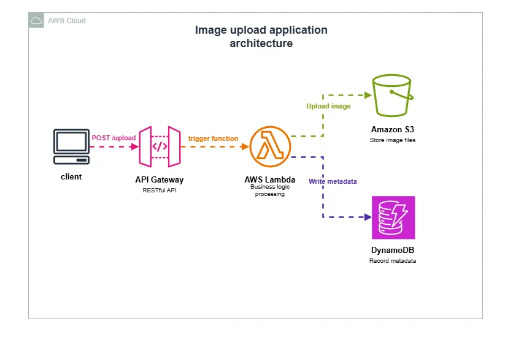

# Grid Builder API - AWS Serverless Image Grid Generator

A serverless API built on AWS that creates photo grids from uploaded images using Lambda, API Gateway, DynamoDB, and S3.

## 🏗️ Architecture Overview



```


User Upload → API Gateway → Lambda (add_image) → S3 (source-bucket)
                                                 ↓
                                              DynamoDB (GridBuilder)
                                                 ↓
User Request → API Gateway → Lambda (generate_grid) → S3 (destination-bucket)
```

## 📋 Prerequisites

- AWS Account
- AWS CLI configured
- Python 3.12/3.13
- Basic knowledge of AWS services

### 🔐 IAM Permissions Setup
Ensure the IAM Role attached to your Lambda functions has the following permissions policies:

 *  **AWSLambdaBasicExecutionRole**
    *  Required for writing logs to CloudWatch.
 * **AmazonS3FullAccess** (or granular access)
    * To read images from the source bucket and write the grid to the destination bucket.
 *  **AmazonDynamoDBFullAccess** (or granular access)
    * To read/write metadata to the `GridBuilder` table.

> **Note:** For a production environment, it is recommended to restrict S3 and DynamoDB access to specific resource ARNs (Least Privilege Principle). For this lab, FullAccess is acceptable.
>
> 

## 📁 Project Structure

```
api-backend-manual/
├── add_image/
│   ├── app.py
│   └── app_solution.py
├── generate_grid/
│   ├── app.py
│   └── app_solution.py
└── source/
    ├── image01.jpg - image16.jpg
    └── (deployment files)
```

---

## 🚀 Step 1: Create DynamoDB Table

Create a DynamoDB table to store the mapping between grid IDs and S3 image keys.

```bash
aws dynamodb create-table \
  --table-name GridBuilder \
  --attribute-definitions \
    AttributeName=uniqueGridId,AttributeType=S \
    AttributeName=s3Key,AttributeType=S \
  --key-schema \
    AttributeName=uniqueGridId,KeyType=HASH \
    AttributeName=s3Key,KeyType=RANGE \
  --provisioned-throughput \
    ReadCapacityUnits=5,WriteCapacityUnits=5
```

**Expected Output:**

```json
{
  "TableDescription": {
    "TableName": "GridBuilder",
    "TableStatus": "CREATING",
    "KeySchema": [
      {
        "AttributeName": "uniqueGridId",
        "KeyType": "HASH"
      },
      {
        "AttributeName": "s3Key",
        "KeyType": "RANGE"
      }
    ]
  }
}
```

---

## 🔧 Step 2: Create Lambda Functions

### 2.1 Create add_image Lambda Function

This function receives image uploads and stores them in S3.

```bash
cd ~/environment/api-backend-manual/add_image
zip -r ../add_image.zip app.py

aws lambda create-function \
  --function-name add_image \
  --runtime python3.12 \
  --timeout 30 \
  --handler app.lambda_handler \
  --role $LAMBDA_ROLE \
  --environment Variables={SOURCE_BUCKET=$SOURCE_BUCKET} \
  --zip-file fileb://~/environment/api-backend-manual/add_image.zip
```

### 2.2 Create generate_grid Lambda Function

This function generates the image grid from uploaded images.

```bash
cd ~/environment/api-backend-manual/generate_grid

# Install Pillow dependency
pip3 install Pillow -t ~/environment/api-backend-manual/source

# Create deployment package
cd ~/environment/api-backend-manual/source
cp ../generate_grid/app.py .
zip -r lambda.zip app.py PIL* pillow*

aws lambda create-function \
  --function-name generate_grid \
  --runtime python3.13 \
  --timeout 20 \
  --memory-size 256 \
  --handler app.lambda_handler \
  --role $LAMBDA_ROLE \
  --environment Variables={SOURCE_BUCKET=$SOURCE_BUCKET,DESTINATION_BUCKET=$DESTINATION_BUCKET} \
  --zip-file fileb://lambda.zip
```

**Configuration in app.py:**

```python
tile_size = 700  # Adjust this value for larger/smaller grid tiles
```

---

## 🌐 Step 3: Create API Gateway

### 3.1 Create HTTP API

1. Navigate to API Gateway in AWS Console
2. Click **Create API** → **HTTP API** → **Build**
3. Configure:
   - **API name**: `generate-grid`
   - **Add integrations**:
     - Lambda: `add_image` function
     - Lambda: `generate_grid` function

### 3.2 Configure Routes

Add the following routes:

| Method | Path | Integration |
|--------|------|-------------|
| POST | /add_image | add_image Lambda |
| POST | /generate_grid | generate_grid Lambda |

### 3.3 Enable Auto-Deploy

- Navigate to **Stages** → **$default**
- Enable **Automatic Deployment**
- Deploy the API

### 3.4 Get Invoke URL

Copy the invoke URL (format: `https://xxxxx.execute-api.region.amazonaws.com`)

---

## ✅ Step 4: Test the API

### 4.1 Set Environment Variables

```bash
export baseUrl="https://YOUR-API-ID.execute-api.us-west-2.amazonaws.com"
export uniqueGridId=$(date +%s)
echo "Grid ID: ${uniqueGridId}"
```

### 4.2 Upload Images

```bash
cd ~/environment/api-backend-manual/source

for i in {01..16}; do
  curl -X POST --data-binary @image${i}.jpg \
    "${baseUrl}/add_image?uniqueGridId=${uniqueGridId}"
done
```

### 4.3 Generate Grid

```bash
curl -s -X POST "${baseUrl}/generate_grid?uniqueGridId=${uniqueGridId}" | jq '.'
```

**Expected Response:**

```json
{
  "message": "built grid",
  "presigned_url": "https://destination-images-bucket.s3.amazonaws.com/xxx.jpg?..."
}
```

### 4.4 View Grid

Extract and open the presigned URL:

```bash
curl -s -X POST "${baseUrl}/generate_grid?uniqueGridId=${uniqueGridId}" | jq -r '.presigned_url'
```

Copy the URL and open in a browser to view your grid.

---

## 🐛 Troubleshooting

### Issue 1: "Not Found" Error (404)

**Symptom:**

```json
{
  "message": "Not Found"
}
```

**Diagnosis:**

```bash
# Check if routes exist
aws apigatewayv2 get-routes --api-id YOUR-API-ID --region us-west-2

# Look for missing "Target" field in routes
```

**Solution:**

The route exists but is not connected to Lambda integration.

1. **Create Lambda integration:**

```bash
INTEGRATION_ID=$(aws apigatewayv2 create-integration \
  --api-id YOUR-API-ID \
  --integration-type AWS_PROXY \
  --integration-uri arn:aws:lambda:REGION:ACCOUNT:function:generate_grid \
  --payload-format-version 2.0 \
  --region us-west-2 \
  --query 'IntegrationId' \
  --output text)

echo "Integration ID: $INTEGRATION_ID"
```

2. **Attach integration to route:**

```bash
aws apigatewayv2 update-route \
  --api-id YOUR-API-ID \
  --route-id YOUR-ROUTE-ID \
  --target "integrations/$INTEGRATION_ID" \
  --region us-west-2
```

3. **Grant API Gateway permission to invoke Lambda:**

```bash
aws lambda add-permission \
  --function-name generate_grid \
  --statement-id apigateway-invoke \
  --action lambda:InvokeFunction \
  --principal apigateway.amazonaws.com \
  --source-arn "arn:aws:execute-api:REGION:ACCOUNT:API-ID/*/*" \
  --region us-west-2
```

---

### Issue 2: "No module named 'PIL'" Error

**Symptom:**

```
ModuleNotFoundError: No module named 'PIL'
```

**Diagnosis:**

```bash
# Check if PIL is in the Lambda deployment package
unzip -l lambda.zip | grep -i PIL
```

**Solution:**

Pillow library is missing from the Lambda deployment package.

```bash
cd ~/environment/api-backend-manual/source

# Install Pillow locally
pip3 install Pillow -t .

# Add to existing zip
zip -ur lambda.zip PIL pillow-*.dist-info pillow.libs

# Update Lambda
aws lambda update-function-code \
  --function-name generate_grid \
  --zip-file fileb://lambda.zip \
  --region us-west-2
```

---

### Issue 3: "No module named 'app'" Error

**Symptom:**

```
Runtime.ImportModuleError: Unable to import module 'app': No module named 'app'
```

**Diagnosis:**

```bash
# Check if app.py is in the zip root
unzip -l lambda.zip | grep "app.py"
```

**Solution:**

The `app.py` file is missing or in the wrong location in the zip file.

```bash
cd ~/environment/api-backend-manual/source

# Find the correct app.py
find ~/environment/api-backend-manual -name "app.py" -type f

# Copy generate_grid app.py to source directory
cp ../generate_grid/app.py .

# Add to zip (must be in root, not subdirectory)
zip -u lambda.zip app.py

# Update Lambda
aws lambda update-function-code \
  --function-name generate_grid \
  --zip-file fileb://lambda.zip \
  --region us-west-2
```

---

### Issue 4: Grid Images Too Small

**Symptom:** Generated grid images are too small or low quality.

**Solution:**

Edit the `tile_size` variable in `app.py`:

```bash
cd ~/environment/api-backend-manual/source
nano app.py
```

Find and modify:

```python
# Change from:
tile_size = 100

# To (for larger images):
tile_size = 700
```

Redeploy:

```bash
zip -u lambda.zip app.py
aws lambda update-function-code \
  --function-name generate_grid \
  --zip-file fileb://lambda.zip \
  --region us-west-2
```

---

### Issue 5: Internal Server Error

**Symptom:**

```json
{
  "message": "Internal Server Error"
}
```

**Diagnosis:**

Check Lambda logs for detailed error messages:

```bash
# View live logs
aws logs tail /aws/lambda/generate_grid --region us-west-2 --follow

# View recent logs (last 10 minutes)
aws logs tail /aws/lambda/generate_grid --region us-west-2 --since 10m
```

**Common Causes:**
- Missing dependencies in deployment package
- Incorrect environment variables
- Lambda timeout (increase to 30s)
- Insufficient Lambda memory (increase to 512MB)

---

## 🛠️ Useful Commands

### Check API Gateway Configuration

```bash
# List all routes
aws apigatewayv2 get-routes --api-id YOUR-API-ID --region us-west-2

# List integrations
aws apigatewayv2 get-integrations --api-id YOUR-API-ID --region us-west-2

# Get stage info
aws apigatewayv2 get-stages --api-id YOUR-API-ID --region us-west-2
```

### Check Lambda Configuration

```bash
# Get function details
aws lambda get-function --function-name generate_grid --region us-west-2

# View environment variables
aws lambda get-function-configuration \
  --function-name generate_grid \
  --region us-west-2 \
  --query 'Environment'
```

### Check DynamoDB

```bash
# Verify table exists
aws dynamodb describe-table --table-name GridBuilder

# Scan table contents
aws dynamodb scan --table-name GridBuilder --region us-west-2
```

---

## ⚙️ Configuration Reference

### Lambda Environment Variables

**add_image function:**
- `SOURCE_BUCKET`: S3 bucket for uploaded images

**generate_grid function:**
- `SOURCE_BUCKET`: S3 bucket with source images
- `DESTINATION_BUCKET`: S3 bucket for generated grids

### Lambda Configuration

| Setting | add_image | generate_grid |
|---------|-----------|---------------|
| Runtime | Python 3.12 | Python 3.13 |
| Timeout | 30s | 20s |
| Memory | 128 MB | 256 MB |
| Handler | app.lambda_handler | app.lambda_handler |

---

## 🧹 Clean Up

To avoid ongoing charges, delete the resources:

```bash
# Delete Lambda functions
aws lambda delete-function --function-name add_image --region us-west-2
aws lambda delete-function --function-name generate_grid --region us-west-2

# Delete API Gateway
aws apigatewayv2 delete-api --api-id YOUR-API-ID --region us-west-2

# Delete DynamoDB table
aws dynamodb delete-table --table-name GridBuilder --region us-west-2

# Empty and delete S3 buckets (do this via Console or with proper scripts)
```

---

## 📄 Appendix: Complete Lambda Code

### add_image/app.py

```python
import os
import json
import boto3
import base64

s3 = boto3.client("s3")
dynamodb = boto3.client("dynamodb")
table_name = "GridBuilder"
source_bucket = os.getenv('SOURCE_BUCKET')

def lambda_handler(event, context):
    event_body = base64.b64decode(
        event["body"]) if event["isBase64Encoded"] else event["body"]
    uniqueGridId = event["queryStringParameters"]["uniqueGridId"]
    
    # Save the s3 object with a random name
    object_key = os.urandom(16).hex() + ".jpg"
    print(f"Saving to bucket: {source_bucket} key: {object_key}")
    
    s3.put_object(
        Bucket=source_bucket,
        Key=object_key,
        Body=event_body,
        ContentType='image/jpg'
    )
    
    # Save the mapping from uniqueGridId to s3 object
    dynamodb.put_item(
        TableName=table_name,
        Item={
            "uniqueGridId": {"S": uniqueGridId},
            "s3Key": {"S": object_key}
        }
    )
    
    return {
        "statusCode": 200,
        "headers": {"access-control-allow-origin": "*"},
        "body": json.dumps({
            "message": "image saved",
            "image_size": len(event_body)
        }),
    }
```

### generate_grid/app.py

```python
import math
import os
import json
import boto3
import io
import tempfile
from PIL import Image

source_bucket = os.getenv('SOURCE_BUCKET')
destination_bucket = os.getenv('DESTINATION_BUCKET')
s3 = boto3.client("s3")
dynamodb = boto3.client("dynamodb")
table_name = "GridBuilder"
tile_size = 700  # Adjust this for larger/smaller tiles

def lambda_handler(event, context):
    uniqueGridId = event["queryStringParameters"]["uniqueGridId"]
    
    # Ask DynamoDB for the list of images
    response = dynamodb.query(
        TableName=table_name,
        KeyConditions={
            "uniqueGridId": {
                "AttributeValueList": [{"S": uniqueGridId}],
                'ComparisonOperator': 'EQ'
            }
        }
    )
    
    source_images = [item["s3Key"]["S"] for item in response["Items"]]
    image_count = len(source_images)
    print(f"Converting: {image_count} source images.")
    
    # Calculate the height, width of the grid
    tiles_width = math.floor(math.sqrt(image_count))
    tiles_height = math.ceil(image_count / tiles_width)
    print(f"Creating: {tiles_width} x {tiles_height} grid.")
    
    destination_image = Image.new(
        mode="RGB",
        size=(tiles_width * tile_size, tiles_height * tile_size)
    )
    
    for y in range(tiles_height):
        for x in range(tiles_width):
            if source_images:
                filename = source_images.pop()
                response = s3.get_object(Bucket=source_bucket, Key=filename)
                image_data = response['Body'].read()
                img = Image.open(io.BytesIO(image_data))
                img_width = img.size[0]
                img_height = img.size[1]
                
                # Crop the image to a square
                crop_square = min(img.size)
                img = img.crop((
                    (img_width - crop_square) // 2,
                    (img_height - crop_square) // 2,
                    (img_width + crop_square) // 2,
                    (img_height + crop_square) // 2
                ))
                img = img.resize((tile_size, tile_size))
                
                # Draw the image onto the destination grid
                destination_image.paste(img, (x * tile_size, y * tile_size))
    
    # Save the output image to a temp file
    temp_file = tempfile.NamedTemporaryFile(suffix='.jpg').name
    destination_image.save(temp_file)
    print(f"Creating temp file {temp_file}")
    
    # Copy the grid to a randomly named object in destination bucket
    destination_key = os.urandom(16).hex() + ".jpg"
    with open(temp_file, 'rb') as data:
        s3.put_object(
            Bucket=destination_bucket,
            Key=destination_key,
            Body=data,
            ContentType='image/jpg'
        )
    print(f"Saved file to s3 bucket: {destination_bucket}, key: {destination_key}")
    
    presigned_url = s3.generate_presigned_url(
        "get_object",
        Params={"Bucket": destination_bucket, "Key": destination_key},
        ExpiresIn=5 * 60
    )
    
    return {
        "statusCode": 200,
        "headers": {"access-control-allow-origin": "*"},
        "body": json.dumps({
            "message": "built grid",
            "presigned_url": presigned_url
        }),
    }
```

---

## 📝 License

This project is for educational purposes.

## 🤝 Contributing

Contributions welcome! Please open an issue or submit a pull request.

---

## 📚 Additional Resources

- [AWS Lambda Documentation](https://docs.aws.amazon.com/lambda/)
- [API Gateway Documentation](https://docs.aws.amazon.com/apigateway/)
- [DynamoDB Documentation](https://docs.aws.amazon.com/dynamodb/)
- [Boto3 Documentation](https://boto3.amazonaws.com/v1/documentation/api/latest/index.html)


